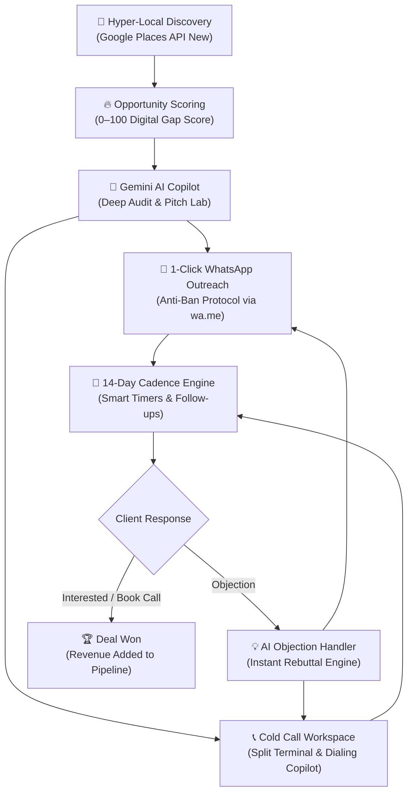

# Client Hunter — AI-Powered B2B Client Acquisition System

<p align="center">
  
  
  
  
  
  
  
  
</p>

---

## ⚡ Overview

**Client Hunter** is an enterprise-grade, high-velocity B2B revenue and client acquisition desktop workstation. Built specifically for digital agencies, web developers, marketing consultants, and B2B service providers, it discovers high-intent local business prospects across India, scores digital opportunity potential, conducts automated deep AI audits, and executes multi-channel client acquisition via **100% ban-proof WhatsApp outreach** and a **dedicated mobile-first Cold Calling workspace**.

Operating as an offline-first Windows desktop application with self-healing backend processes, Client Hunter guarantees **zero data loss** through dual-tier persistence (local disk snapshotting + optional Supabase cloud synchronization), granular **modular category data reset controls**, and an in-app **ClientHunter AI Assistant** for real-time performance intelligence and contextual pitch drafting.

---

## 🚀 End-to-End Client Acquisition Pipeline



---

## 🌟 Innovative Features & System Modules

### 1. 📍 Hyper-Local Discovery Engine
* **Google Places API (New)**: Next-generation multi-page text search pagination querying live business listings across all **36 Indian States & Union Territories** and **750+ districts**.
* **50+ Pre-Configured High-Value Niches**: Real Estate, Dental Clinics, Spas & Salons, Gyms, Cafes, Hospitals, Boutiques, Coaching Centers, and more.
* **Coordinate-Aware Geo-Biasing**: City-centric coordinate resolution with dynamic radius biasing (1–100 km) to surface hyper-targeted geographical clusters.
* **Duplicate Lead Shield**: Automatic duplicate suppression during active discovery matching unique Google Place IDs and normalized E.164 phone numbers.

### 2. 🔥 Intelligent Opportunity Scoring Algorithm (0–100)
* **Website Gap Detection**: Automatically isolates businesses with missing, broken, or outdated web presences, or those operating exclusively via unverified social pages (**+40 Opportunity Score**).
* **Reputation & Review Diagnostics**: Analyzes rating tiers and user review density to uncover high-volume businesses ripe for digital conversion upgrades or reputation engineering.
* **Smart Tiering & Action Triggers**: Categorizes prospects into **High**, **Medium**, and **Low** opportunity tiers with explicit reasoning breakdowns for each lead.

### 3. 🧠 Gemini AI Growth Copilot & Pitch Lab
* **Deep Business Digital Audits (`/api/leads/:id/ai-audit`)**: Generates an instant, comprehensive 4-point agency audit for any selected lead:
  1. *Executive Summary*: 2-sentence situational assessment.
  2. *Top 3 Revenue Leaks*: Pinpoints missing digital assets, poor mobile accessibility, or booking bottlenecks.
  3. *Recommended High-Ticket Solutions*: Tailored agency deliverables (custom web apps, WhatsApp automated booking flows, local SEO).
  4. *Cold Pitch Angle & Deal Value*: Recommended positioning with projected project valuation in **INR (₹)**.
* **Real-Time WhatsApp Objection Handling & Rebuttals (`/api/outreach/ai-reply`)**: Instant consultative responses to overcome prospect resistance:
  * *"Too expensive / what are your rates?"*
  * *"We already have a web developer / agency."*
  * *"Send details / portfolio on WhatsApp."*
  * *"Not interested right now."*
  * *"Call or contact me next month."*
* **Contextual Pitch Synthesis**: Powered by Google's **Gemini 3.8 Flash** engine, personalizing pitches based on rating, location, category, and dynamically enabled agency services.

### 4. 📞 Cold Call Workspace & Mobile Calling Terminal
* **2-Column Split Workspace**: Dedicated calling terminal with a filterable queue on the left (Calling Status, Priority, Category, live search, rows choice) and an active calling cockpit on the right.
* **Mobile-First Calling Flow**: Normalized E.164 phone numbers with 1-click clipboard copy (`btn-cc-copy-phone`), clear guidance to dial from mobile, and immediate outcome logging.
* **Granular Outcome Logging**: Record precise call outcomes with single-click chips:
  * *Interested* — logs qualified interest and flags for follow-up
  * *Call Back Later* — reveals date and time picker to schedule the callback
  * *Not Interested* — marks prospect and halts calling sequence
  * *No Answer* & *Wrong Number* — tracks connection status
  * *Converted* — marks lead as converted with live timestamp
* **Interactive Call Scripts**: Collapsible reference script with variable interpolation (`{businessName}`), instant clipboard copy, and inline customization editor with reset capability.
* **Integrated Audit Timeline & Notes**: Automatically writes call outcome records, discussion summaries, and callback alerts to the lead's permanent activity timeline and notes stream.
* **Dedicated Recent Activity Table**: Full-width audit log showing chronological calling history with business name, date/time, color-coded outcome badges, and call notes.
* **Dedicated Cold Call Backup & Safety**: Dedicated JSON export endpoint (`/api/coldcall/export`) and non-destructive lead unqueueing with 1-click tokenized undo recovery (`/api/coldcall/undo-remove`).

### 5. 💬 100% Anti-Ban WhatsApp Outreach Terminal
* **Compliant `wa.me` Deep-Linking Protocol**: Launches messages directly via WhatsApp Web or native WhatsApp Desktop with zero headless browser automation or unauthorized API scraping — eliminating SIM ban risks.
* **Outreach Sequence Queue**: Batch-pitch queued leads sequentially with single-click advancement, keeping focus uninterrupted.
* **11 Field-Tested Pitch Templates**: Curated library with dynamic variable interpolation (`{businessName}`, `{category}`, `{city}`, `{my_name}`, `{my_company}`, `{portfolio_url}`, `{my_services}`).
* **Outcome & Conversion Tracking**: Log call and message statuses (*Contacted*, *Replied*, *Interested*, *Not Interested*, *Not on WhatsApp*).
* **Activity Timeline & Instant Undo**: Complete chronological audit trail with instant undo recovery for accidentally deleted leads or outreach records.

### 6. 📅 Day-Anchored 14-Day Cadence Engine
* **Automated Multi-Touch Follow-Up Schedule**: Systematically anchored to Day 0 (Initial Pitch):
  * **Day 0**: Initial Outreach Pitch
  * **Day 2**: Follow-Up #1 — *Gentle Nudge*
  * **Day 4**: Follow-Up #2 — *Quick Check-in*
  * **Day 7**: Follow-Up #3 — *Value Addition & Portfolio*
  * **Day 10**: Follow-Up #4 — *Low-Pressure Closing*
  * **Day 14**: Follow-Up #5 — *Final Breakaway Note*
* **Smart Urgency Ranking**: Automatically flags due and overdue cadences, surfacing the hottest prospects first.
* **"Stop on Reply" Protection**: Progresses automatically halt as soon as a lead responds, preventing awkward duplicate pitches.
* **Configurable Smart Dispatch Timers**: Power-user automation controls with customizable countdown delays (*Immediate 0s*, *3s*, *5s*, *10s*, *15s*, *20s*, *30s*).

### 7. ✨ ClientHunter AI Assistant (In-App Intelligence & Copilot)
* **Built-in Conversational Assistant**: Slide-out panel (`#ai-assistant-panel`) accessible from the header, dashboard, or keyboard shortcuts.
* **Ground-Truth Verified Data**: Queries exact real-time database numbers for zero-hallucination answers to questions like *"How did I do today?"*, *"What should I work on next?"*, *"How many follow-ups are due?"*, or *"Show Outreach stats"*.
* **Lead-Contextual Drafting**: When inspecting an active lead, ClientHunter AI examines the business name, category, website gap, and notes to draft bespoke pitches on demand.
* **Actionable Navigation Triggers**: Generates interactive quick-navigation buttons in chat bubbles (e.g. `[Open Follow-Ups]`, `[Open Outreach]`, `[Open Saved Leads]`, `[Open API Settings]`).
* **Conversation Management**: Quick suggestion prompt chips and one-click chat history clearing.

### 8. ⚡ Floating Bulk Action Bars & High-Velocity Pagination
* **Universal Floating Action Bars**: Context-aware floating pill action bars for:
  * **Saved Leads**: *Move to Outreach*, *Add to Cold Call*, *Delete*, *Cancel*
  * **Favorite Leads**: *Remove from Favorites*, *Send Message*, *Delete*, *Cancel*
  * **Outreach Queue**: *Send Message*, *Add to Cold Call*, *Delete*, *Cancel*
  * **Follow-Up Pipeline**: *Pause*, *Resume*, *Send Follow-Ups*, *Cancel*
  * **Cold Call Queue**: *Remove from Cold Call*, *Cancel*
* **Configurable Rows Per Page**: Switch between **10**, **25**, **50**, or **100** rows per page across Saved Leads, Favorites, Outreach, Follow-Up, and Cold Call views.
* **Minimal Floating "Go To Top"**: Instant smooth scroll navigation back to the top of long data views.

### 9. 🗃️ Terminal Lead Management & Advanced Filtering
* **High-Performance Offline Table**: Virtualized list handling thousands of leads with instant search and multi-column sorting.
* **Multi-Dimensional Query Filter**: Filter simultaneously by opportunity tier, rating range, review count, geographical region, website presence, and outreach state.
* **Dynamic Color Tags & Notes**: Multi-line timestamped notes and custom color badges for granular lead classification.
* **Saved Views**: Persist and recall complex filter criteria in a single click across desktop sessions.
* **1-Click Favorites**: Dedicated high-priority prospect vault with bulk actions.

### 10. 📊 Performance Analytics & Revenue Dashboard
* **Velocity Metrics**: Real-time tracking of leads discovered, messages sent, response rates, and pipeline progression.
* **Daily Target Milestone Bars**: Visual pacing indicators against daily prospecting goals.
* **Pipeline Valuation Tracker**: Live INR (₹) revenue estimates based on active negotiations and won deals.
* **System Health Diagnostics**: Live reporting of database integrity, connection status, and API availability.

### 11. 🛡️ Dual-Tier Hybrid Persistence & Modular Data Reset Engine
* **Isolated Data Runtime**: All user data, notes, activity history, and settings live securely in `%APPDATA%\clienthunter\data\leads_store.json`, safe from application updates and binary reinstalls.
* **Granular Category-Level Data Reset**: Reset individual system areas without risking master database integrity:
  * *Saved Leads* — removes master leads database and dependent outreach while keeping settings, search sessions, and API keys intact.
  * *Cold Call* — clears calling queue and call outcome records only.
  * *Outreach* — resets outreach progression and tracking while keeping saved leads intact.
  * *Favorites* — unstars prospects without modifying records.
  * *Follow-Up* — resets cadence schedules and pause states without deleting leads.
  * *History* — purges search query sessions only.
  * *Settings* — restores preferences, templates, and profile to defaults.
  * *Reset Everything* — isolated high-risk Danger Zone action requiring explicit modal confirmation.
* **Pre-Reset & Pre-Write Safety Snapshots**: Automatically creates an emergency snapshot (`leads_store_last_valid.json` and timestamped backups) before any reset or disk write.
* **Supabase Cloud Sync (Optional)**: Bidirectional cloud synchronization for remote PostgreSQL backups and multi-device access.

### 12. 📤 RFC 4180 Advanced Export Engine
* **28-Column Full CRM CSV**: Comprehensive export formatted strictly to RFC 4180 specifications.
* **Indian Unicode & ₹ Rupee Support**: Includes UTF-8 BOM (`\uFEFF`) to ensure Excel and Google Sheets render Hindi, Telugu, and ₹ currency symbols flawlessly.
* **Data Sanitization & Format Guard**: Preserves leading zeroes on STD codes and phone numbers (`+91` / `040`) and safely escapes commas and multiline notes.
* **8 Granular Export Scopes**: Export All Saved Leads, Filtered Results, Selected Rows, Favorites, Outreach Queue, Follow-Up Pipeline, Dedicated Cold Call Backup, or Full JSON System Backups.

---

## 💡 Why Client Hunter? (Competitive Matrix)

| Feature / Capability | Traditional Web Scrapers | Manual Google / WhatsApp | Client Hunter 2.2 |
| :--- | :---: | :---: | :---: |
| **Discovery Source** | Stale static directories | Slow manual web search | **Live Google Places API (New)** |
| **Coverage** | Generic / incomplete | Fragmented | **750+ Indian Districts & 36 States** |
| **Opportunity Qualification** | None (raw data dump) | Manual inspection | **Automated 0–100 Opportunity Score** |
| **Deep AI Pitch Audits** | ❌ No | ❌ No | **✅ Gemini 3.8 Flash B2B Audits** |
| **WhatsApp Ban Risk** | 🚨 High (Unregulated Bots) | Low (Tiring & slow) | **🛡️ Zero (100% Compliant wa.me)** |
| **Cold Calling Terminal** | ❌ No | ❌ Scrambled phone dials | **✅ Mobile-First Split Terminal** |
| **In-App AI Copilot** | ❌ No | ❌ No | **✅ Ground-Truth Verified AI** |
| **AI Objection Handler** | ❌ No | ❌ No | **✅ 1-Click WhatsApp Rebuttal Engine** |
| **Cadence Automation** | ❌ Manual spreadsheets | ❌ Easy to forget | **✅ 14-Day Day-Anchored Cadence** |
| **Floating Bulk Action Bars** | ❌ No | ❌ No | **✅ Universal Floating Action Bars** |
| **Modular Category Reset** | ❌ Nuclear data delete only | ❌ Manual row delete | **✅ 8 Isolated Category Resets** |
| **Data Safety & Offline Mode** | ❌ Cloud-dependent / Fragile | ❌ Lost in chat tabs | **✅ Dual-Tier Hybrid Persistence** |
| **Indian Localization (₹ & Unicode)** | ❌ Often garbled | Manual | **✅ Native UTF-8 BOM + INR Pipeline** |

---

## 🛠️ Technology Stack

| Layer | Technology | Role & Architecture |
| :--- | :--- | :--- |
| **Desktop Shell** | Electron 44.4.1 | Native Windows container, maximized startup, single-instance lock, backend lifecycle supervision |
| **Backend API** | Node.js & Express 5.2 | Local REST API, input validation, automated snapshotting, failover recovery, modular reset engine |
| **Frontend UI** | HTML5 & Vanilla CSS3 | Modern glassmorphism dark theme, custom design tokens, micro-interactions, zero framework overhead |
| **Client Logic** | Vanilla JavaScript | State machine architecture with instant DOM reactivity and virtualized queue handling |
| **Cloud Database** | Supabase (PostgreSQL) | Optional cloud backup, sync layer, and multi-machine persistence |
| **AI Engine** | Google Gemini 3.8 Flash | B2B lead audits, pitch personalization, objection rebuttals, conversational in-app copilot |
| **Places Engine** | Google Places API (New) | Hyper-local business discovery and geolocation queries |
| **Packaging** | Electron Builder 26.15.3 | Automated generation of NSIS installer (`.exe`) and portable standalone binaries |

---

## 🖥️ Desktop Application Architecture

Client Hunter runs as a coordinated single-instance desktop workstation:
1. **Single-Instance Enforcement**: Electron secures a single-instance lock, focusing the existing active window if launched again.
2. **Local API Server**: Launches internal Express backend on port 3000 (with automatic conflict resolution if occupied).
3. **Maximized Native Window**: Boots directly in a maximized state with custom styling and system integration.
4. **Self-Healing Backend Watchdog**: Real-time heartbeat supervision automatically restarts backend processes in the rare event of a crash without data loss.

```
+-------------------------------------------------------------+
|                     Client Hunter Desktop                   |
|                                                             |
|   +-----------------------------------------------------+   |
|   |             In-Memory Store State Machine           |   |
|   |   'uninitialized' | 'loaded' | 'empty' | 'failed'   |   |
|   +-----------------------------------------------------+   |
|                              |                              |
|           +------------------+------------------+           |
|           |                                     |           |
|           v                                     v           |
|   +-----------------------+           +------------------+  |
|   | Local JSON Persistence|           |  Supabase Cloud  |  |
|   |   leads_store.json    |           | PostgreSQL Table |  |
|   | (%APPDATA% or ./data) |           |  (public.leads)  |  |
|   +-----------------------+           +------------------+  |
+-------------------------------------------------------------+
```

---

## 🗄️ Data Storage Paths

* **Runtime Data Store**:
  `%APPDATA%\clienthunter\data\leads_store.json`
* **Local Safety Backups**:
  `%APPDATA%\clienthunter\data\backups\`
* **Crash Recovery Fallback**:
  `%APPDATA%\clienthunter\data\leads_store_last_valid.json`
* **Clean Seed Database**:
  `data/leads_store.json` (bundled with installer to initialize clean stores on fresh installations)

> [!IMPORTANT]
> **Zero-Loss Data Isolation**: Runtime data in `%APPDATA%\clienthunter` is fully decoupled from executable binaries. Updating or reinstalling Client Hunter will never overwrite your saved leads, notes, or outreach history.

---

## 🚀 Getting Started

### Prerequisites
* **Node.js** v18.0.0 or higher
* **npm** v9.0.0 or higher
* **Windows 10 / 11** (for desktop binary packaging)

### Installation & Setup

1. **Clone the repository:**
   ```bash
   git clone https://github.com/akshay118R/Client-Hunter.git
   cd Client-Hunter
   ```

2. **Install dependencies:**
   ```bash
   npm install
   ```

3. **Configure Environment Variables:**
   Copy the example `.env.example` file to `.env`:
   ```bash
   cp .env.example .env
   ```
   Open `.env` and provide your API keys:
   ```env
   PORT=3000
   GOOGLE_PLACES_API_KEY=your_google_places_api_key
   GEMINI_API_KEY=your_gemini_api_key
   SUPABASE_URL=https://your-project.supabase.co
   SUPABASE_ANON_KEY=your_supabase_anon_key
   SUPABASE_SERVICE_ROLE_KEY=your_supabase_service_role_key
   ```

4. **Launch Application in Development Mode:**
   ```bash
   npm run desktop:dev
   ```
   *To launch only the local server for browser testing:*
   ```bash
   npm start
   ```

5. **Initialize Supabase Cloud Tables (Optional):**
   Run the contents of `supabase_schema.sql` inside your Supabase SQL Editor.

---

## 📦 Packaging & Build Instructions

Client Hunter uses Electron Builder to produce standalone production distributions:

### 1. Build Unpacked Testing Directory
Compiles the application without packaging into an installer:
```bash
npm run desktop:build
```
* **Output Binary**: `dist/win-unpacked/Client Hunter.exe`

### 2. Build Production Distributions (Installer & Portable)
Generates high-compression release executables:
```bash
npm run desktop:dist
```
* **NSIS Setup Installer**: `dist/Client Hunter-Setup.exe`
* **Standalone Portable Executable**: `dist/Client Hunter-Portable.exe`

---

## 🔄 Version Information

* **Application Version**: `2.2.0`
* **Release Build**: `CH-20260920-R1`
* **Update Verification**: Navigate to **Settings > About** and click **Check for Updates** to compare your active build with the latest release.

---

## 🛡️ License

This project is licensed under the **MIT License** — see the `LICENSE` file for details.
